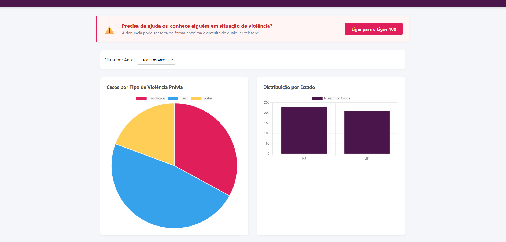

# 📊 Atlas da Violência Feminina no Brasil

Um dashboard interativo e dinâmico focado no monitoramento e análise de dados reais de feminicídio e indicadores de violência prévia contra a mulher no Brasil. O projeto foi desenhado com foco em utilidade pública, acessibilidade e alto impacto social.

## 🚀 Tecnologias Utilizadas

- **Frontend:** HTML5, CSS3, JavaScript (Vanilla ES6) e [Chart.js](https://www.chartjs.org/) para a renderização gráfica e dinâmica dos dados.

- **Backend:** Python com o micro-framework [Flask](https://flask.palletsprojects.com/) estruturando uma API RESTful ágil.

- **Banco de Dados:** SQLite para armazenamento local relacional, leve e estruturado.

---

## ⚖️ Recursos de Impacto Social & UX
- **Filtros Dinâmicos:** Filtragem de dados por período e anos diretamente consumidos da API Flask.
- **Canais de Emergência (Ligue 180):** Integração com sistemas de discagem rápida direcionados à Central de Atendimento à Mulher, permitindo acionamento imediato e intuitivo em dispositivos móveis ou computadores configurados para chamadas.


## 🚀 Tecnologias Utilizadas

- **Frontend:** HTML5, CSS3, JavaScript (Vanilla ES6) e [Chart.js](https://www.chartjs.org/) para a renderização gráfica e dinâmica dos dados.
- **Backend:** Python com o micro-framework [Flask](https://flask.palletsprojects.com/) estruturando uma API RESTful ágil.
- **Banco de Dados:** SQLite para armazenamento local relacional, leve e estruturado.

---

## ⚖️ Recursos de Impacto Social & UX
- **Filtros Dinâmicos:** Filtragem de dados por período e anos diretamente consumidos da API Flask.
- **Canais de Emergência (Ligue 180):** Integração com sistemas de discagem rápida direcionados à Central de Atendimento à Mulher, permitindo acionamento imediato e intuitivo em dispositivos móveis ou computadores configurados para chamadas.

---

## 🛠️ Como Executar o Projeto Localmente

* Pré-requisitos
Antes de começar, você vai precisar ter o Python instalado em sua máquina.

### 1. Clonar o repositório
```bash
git clone https://github.com/gisianecode/atlas-da-violencia-feminina.git
cd atlas-da-violencia-feminina

```
### 2. Configurar o Backend
Abra o terminal na raiz do projeto e instale as dependências necessárias:
```bash
pip install -r requirements.txt

```
Entre na pasta do backend e execute o servidor Flask:
```bash
cd backend
python app.py

```
O servidor iniciará automaticamente na porta 5000 e criará o arquivo de banco de dados local database.db, populando-o com os dados iniciais contidos no arquivo JSON.

### 3. Configurar o Frontend
Com o servidor backend rodando em segundo plano, navegue até a pasta frontend e abra o arquivo index.html em qualquer navegador de sua preferência (ou utilize a extensão *Live Server* do VS Code).

## 🔮 Melhorias Futuras (Roadmap de Evolução)
Para elevar o nível técnico e a utilidade da plataforma, as seguintes funcionalidades estão planejadas para as próximas iterações do ecossistema:

### 🚀 Frontend & Visualização de Dados
 * **Mapa Interativo (Heatmap):** Integração com a biblioteca Leaflet.js para exibir um mapa de calor do Brasil, permitindo a visualização geográfica dos casos por estado e município.

 * **Evolução Temporal Dinâmica:** Criação de gráficos de linha (line charts) para analisar a tendência histórica (crescimento ou redução) dos casos ao longo dos anos.

 * **Modo Escuro (Dark Mode):** Implementação de um tema alternativo focado em acessibilidade visual e conforto de navegação.

### ⚙️ Backend, Dados & Infraestrutura
 * **Automação de Coleta (Web Scraping):** Desenvolvimento de scripts em Python utilizando BeautifulSoup ou Selenium para capturar dados atualizados diretamente dos portais das Secretarias de Segurança Pública e do Fórum Brasileiro de Segurança Pública.

 * **Migração para API Pública:** Substituição da base de dados mockada por integrações diretas com APIs governamentais de dados abertos.

 * **Autenticação e Painel Administrativo:** Criação de um sistema seguro de login para que organizações parceiras e ONGs possam reportar ou atualizar dados diretamente no sistema.

## 📄 Licença
Este projeto está sob a licença MIT. Consulte o arquivo LICENSE para obter mais detalhes.

